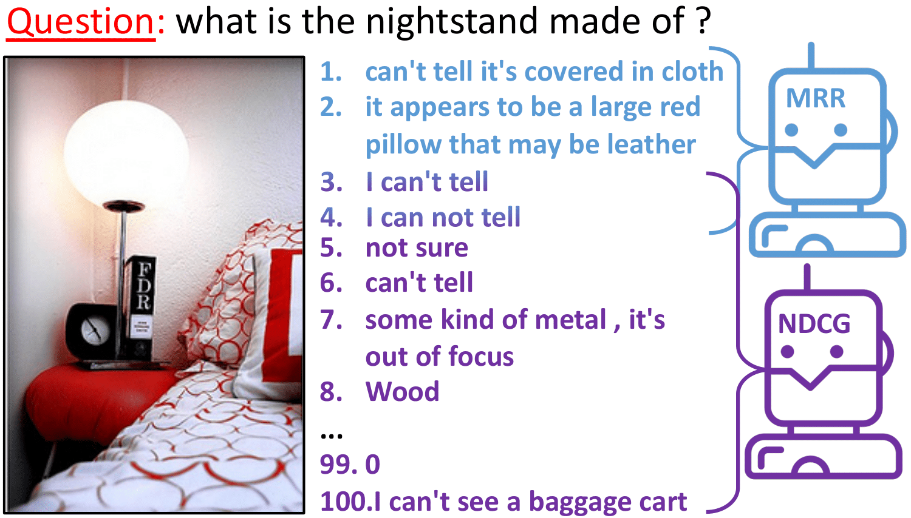

# Ensemble of MRR and NDCG models for Visual Dialog
* 2020 Visual Dialog challenge winning submission.

This repository is the official implementation of [Ensemble of MRR and NDCG models for Visual Dialog](https://arxiv.org/abs/2104.07511).
(To appear in NAACL'21)

We propose a two-step non-parametric ranking approach that can merge strong MRR and NDCG models. Using our method, we manage to keep most MRR state-of-the-art performance (70.41% vs. 71.24%) and the NDCG state-of-the-art performance (72.16% vs. 75.35%). 

 
 
 The approach is a ranks ensemble of:
 * The MRR model: [Factor Graph Attention](https://github.com/idansc/fga)
 * The NDCG model: [Large-scale Pretraining for Visual Dialog: A Simple State-of-the-Art Baseline](https://github.com/vmurahari3/visdial-bert)


## Preprocessed data:

Place the following meta under the data dir:
https://technionmail-my.sharepoint.com/:f:/g/personal/idansc_campus_technion_ac_il/EtF8106BEL9Bg_l8aO1KgC4BX8FgFQvkFRGIRspzITJGFA?e=y5AYFP


Place the following models' scores under models dir:
https://technionmail-my.sharepoint.com/:f:/g/personal/idansc_campus_technion_ac_il/EjGDSbKTtJJCjtweIxG3dUIBXq9IXChBXrB3GVQCxND8hw?e=jelNAo

## Run

Please follow the jupyet notebook: ```Two-step ranks ensemble.ipynb```.
